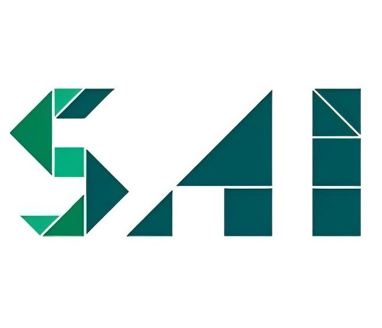
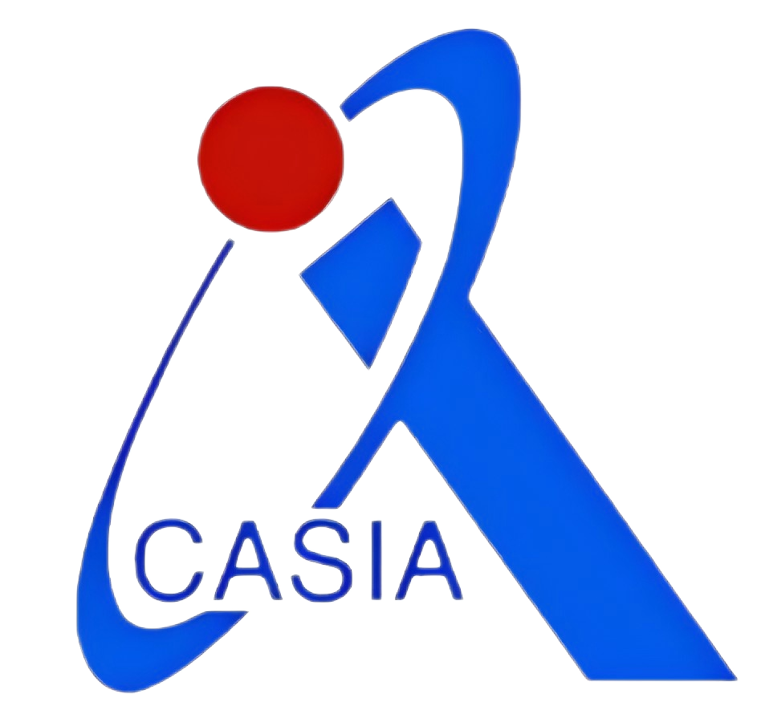

# 
Jiashu Yang (杨佳澍)

  

  

    <i class="fas fa-map-marker-alt"></i> Beijing, China &nbsp;&nbsp;
    <a href="mailto:your.email@example.com">Email</a> &nbsp;&nbsp;
    <a href="https://scholar.google.com/citations?user=BRXghWcAAAAJ&hl=en">Google Scholar</a> &nbsp;&nbsp;
    <a href="https://www.zhihu.com/people/22-49-46-76/posts">Zhihu</a>
  

---

### 📝 About Me
Hello, I'm **Jiashu Yang (杨佳澍)**. My research interests include **open-world visual understanding** and **large models** (language, vision, and action). I am committed to the research of practical and deployable intelligent algorithms.

- **LLM Leadership**: Led and open-sourced [Wenyuan Pavilion](https://github.com/Kongzi-Large-Model), a community focused on developing Chinese-culture-centered open-source LLMs.
- **Embodied AI**: From November 2023 to September 2025, I conducted research on **embodied visual systems** and developed an **eyeball system**. [Paper link](https://arxiv.org/abs/2511.15279)
- **Collaborations**: Worked with **Prof. Huchuan Lu (IEEE Fellow)** and **Prof. Xu Jia** on research related to multimodal Retrieval-Augmented Generation (RAG).

---

### 📖 Education
-  **Dalian University of Technology** | BEng., Artificial Intelligence | 2022.09 - 2026.06 (Expected)
- 🚀 **Seeking PhD positions for Fall 2026 admission!**

---

### 📝 Publications
- **EvaGaussians: Event Stream Assisted Gaussian Splatting from Blurry Images** | *ICCV 2025* | [Paper](https://arxiv.org/abs/2405.20224) | Citations: 55
- **Kongzi: A Historical Large Language Model with Fact Enhancement** | *COLM 2026* | [Paper](https://arxiv.org/abs/2504.09488) | Citations: 2
- **Tune-Your-Style: Intensity-tunable 3D Style Transfer with Gaussian Splatting** | *ICCV 2025* | [Paper](https://arxiv.org/abs/2602.00618) | Citations: 1
- **Breaking the Vicious Cycle: Coherent 3D-GS from Sparse & Blurred Views** | *TCSVT 2025* | [Paper](https://arxiv.org/pdf/2512.10369)
- **Look, Zoom, Understand: The Robotic Eyeball for Embodied Perception** | *ACMMM 2026* | [Paper](https://arxiv.org/abs/2511.15279)
- **AutothinkRAG: Complexity-Aware Control of Retrieval-Augmented Reasoning for Image-Text Interaction** | *ACL 2026* | [Paper](https://arxiv.org/pdf/2603.05551)
- **Prospective and intelligent antiviral drug design against potential viral variants** | *Bioinformatics*
- **A survey of document understanding** | Project Leader
- **A survey of activate perception** | Project Leader

---

### 💼 Work Experience
-  **Meituan**, Beijing | Longcat Interaction | 2025.12 - Now
-  **IIAU Lab, Shanghai Jiao Tong University** | Research Assistant | 2025.07 - 2025.09
-  **ByteDance**, Beijing | Applications of Large Language Models | 2025.04 - 2025.07
-  **IIAU Lab, Dalian University of Technology** | Research Assistant | 2024.05 - 2025.01
-  **Institute of Automation, Chinese Academy of Sciences (CAS)** | Research Internship | 2023.11 - 2024.08

---

### 💻 Projects
- **Squirrel**: A multi-modal PDF interaction tool (Launched January 15, 2025).
-  **Wenyuan Pavilion**: Lead researcher for an Ancient Chinese Language Community and domain-specific LLMs. [GitHub](https://github.com/Kongzi-Large-Model)

---

### 🎖 Honors and Awards
- **National First Prize** (2023): Robocup, Advanced Vision Track - Industrial Measurement
- **National Third Prize** (2024): Robocup, Advanced Vision Track - 3D Detection
- **National Third Prize** (2024): Robocup, Advanced Vision Track - Industrial Measurement
- **National Third Prize** (2024): China University Computer Competition

---

  
<i>Visit my full academic homepage at <a href="https://yang-jiashu.github.io/">yang-jiashu.github.io</a></i>

